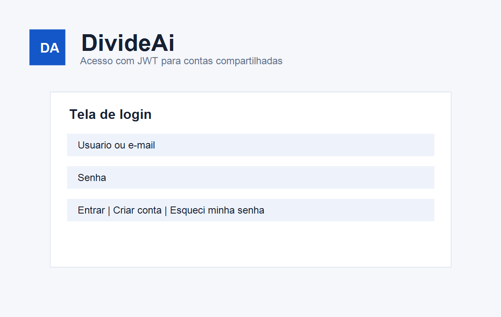
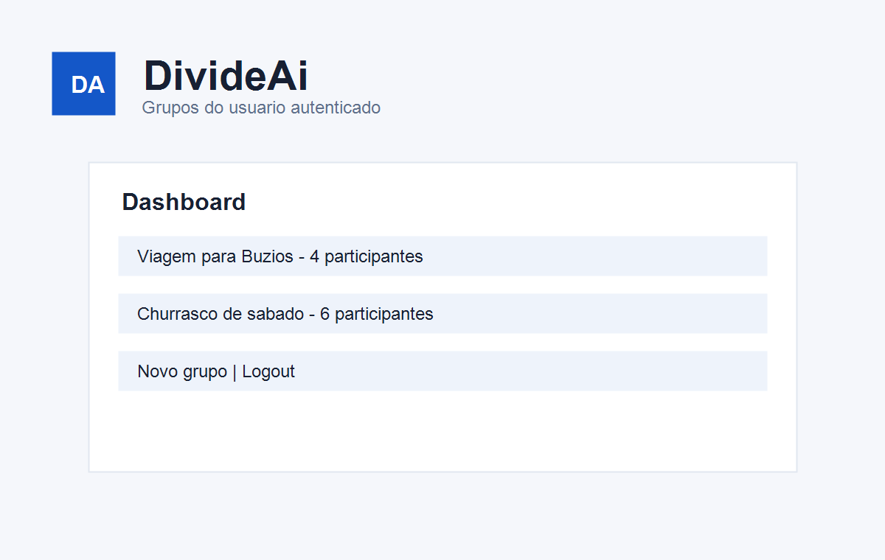
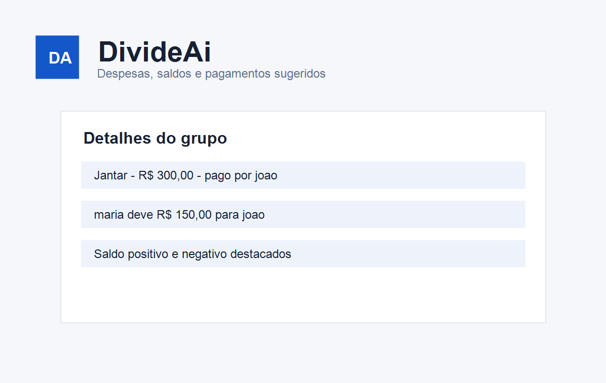

# DivideAi Frontend

Interface web da aplicacao DivideAi, criada com HTML, CSS e TypeScript puro para consumir a API Django do backend.

## Integrantes

- Nome do integrante 1
- Nome do integrante 2
- Nome do integrante 3

## Descricao do projeto

O frontend permite cadastro, login, recuperacao simulada de senha, troca de senha, gerenciamento de grupos, cadastro de despesas compartilhadas e visualizacao dos saldos calculados pela API.

## Tecnologias utilizadas

- HTML
- CSS
- TypeScript
- Vite

## Instalacao local

1. Clonar o repositorio:
   ```bash
   git clone LINK_DO_REPOSITORIO_FRONTEND
   cd divideai-frontend
   ```
2. Instalar dependencias:
   ```bash
   npm install
   ```
3. Configurar a URL da API em um arquivo `.env`, se necessario:
   ```env
   VITE_API_BASE_URL=http://localhost:8000/api
   ```
4. Rodar o projeto localmente:
   ```bash
   npm run dev
   ```
5. Acessar o endereco indicado pelo Vite, normalmente `http://localhost:5173`.

## Como usar

1. Acesse a tela de cadastro e crie uma conta.
2. Volte para o login e entre com usuario e senha.
3. No dashboard, crie um grupo e selecione participantes.
4. Abra o grupo e cadastre uma despesa com valor, pagador e participantes da divisao.
5. Veja a area de saldos para conferir quem pagou, quem deve e os pagamentos sugeridos.
6. Use a tela de troca de senha para alterar a senha do usuario autenticado.
7. Use o botao de logout para encerrar a sessao.

## Manual do usuario

### Cadastro

Informe nome de usuario, e-mail, senha e confirmacao. Depois faca login com a conta criada.

### Login

Informe usuario e senha. O token JWT e salvo no `localStorage` para manter a sessao.

### Esqueci minha senha

Informe o e-mail. A aplicacao mostra uma mensagem de sucesso simulada, conforme implementado no backend.

### Grupos

No dashboard, clique em `Novo grupo`, preencha nome e descricao e selecione participantes. A edicao e exclusao ficam disponiveis na tela de detalhes.

### Despesas

Dentro do grupo, clique em `Adicionar despesa`, informe titulo, descricao, valor, usuario que pagou e participantes. Despesas existentes podem ser editadas ou excluidas.

### Saldos

A tela de detalhes do grupo mostra totais pagos, valores devidos, saldo positivo ou negativo e sugestoes de pagamento.

## Imagens da aplicacao





## Deploy

Sugestoes de hospedagem: Vercel, Netlify, GitHub Pages ou AWS.

Configure a variavel de ambiente no provedor:

```env
VITE_API_BASE_URL=https://LINK_DO_BACKEND_PUBLICADO/api
```

Depois rode o build:

```bash
npm run build
```

Link do frontend publicado: `INSERIR_LINK_DO_DEPLOY_FRONTEND`

## O que foi desenvolvido

- Projeto separado do backend.
- Interface responsiva com HTML e CSS puro.
- Codigo de comportamento em TypeScript.
- Roteamento simples por hash.
- Login com JWT e armazenamento em `localStorage`.
- Cadastro, logout, reset simulado e troca de senha.
- CRUD de grupos.
- CRUD de despesas.
- Consumo do endpoint de saldos.
- Mensagens simples de erro e sucesso.

## O que funcionou

- Fluxo de cadastro e login.
- Protecao das telas internas quando nao ha token.
- Listagem de grupos do usuario autenticado.
- Criacao, edicao e exclusao de grupos.
- Criacao, edicao e exclusao de despesas.
- Exibicao de participantes, saldos e pagamentos sugeridos.
- Logout e troca de usuario, com alteracao dos dados exibidos conforme o token.

## O que nao funcionou

- O envio real de e-mail do esqueci minha senha nao foi implementado; a funcionalidade e simulada pelo backend.
- As imagens do README sao capturas/representacoes locais salvas em `public/screenshots`.

## Link do projeto

- Repositorio frontend: `INSERIR_LINK_DO_REPOSITORIO_FRONTEND`
- Deploy frontend: `INSERIR_LINK_DO_DEPLOY_FRONTEND`
